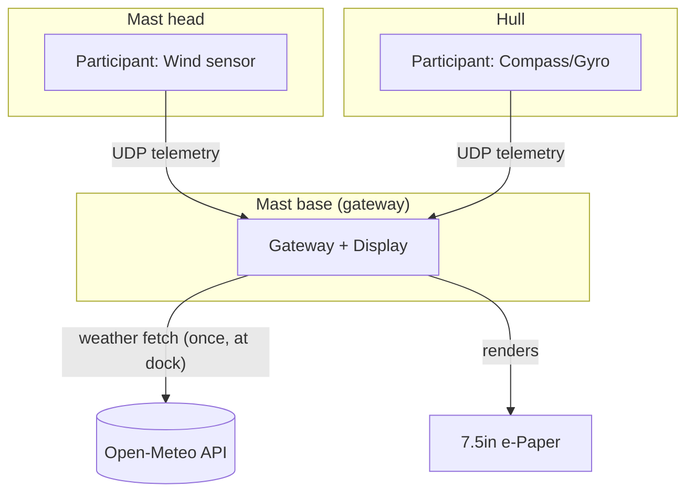

# Sailing Dinghy Telemetry System — Architecture

## System overview



One physical unit — the **gateway** — is mast-mounted, hosts the WiFi AP, owns the
e-paper display, fetches weather once before departure, and aggregates telemetry
from any number of **participants** (sensor nodes). Participants only ever talk to
the gateway; they never talk to each other or to the internet.

## Repositories

| Repo | Role | Notes |
|---|---|---|
| `DinghyDisplay` | **Gateway + Display** firmware (merged) | Absorbs `hello_wifi`'s AP/STA + weather-fetch logic. Owns the e-paper rendering. |
| `hello_wifi` | Reference/testbed only | Kept as a standalone AP+weather sandbox for experimentation; not flashed for production. |
| `hello_wifi_participant` → **participant-compass-gyro** | Compass/gyro participant firmware | Reuses `participant_core`. ISM330 driver promoted here from `hello_world`. |
| **participant-wind** (new) | Wind participant firmware, masthead-mounted | Reuses `participant_core`. |
| `hello_world` | Sensor bring-up sandbox | IMU code migrates out once `participant-compass-gyro` exists; repo kept for future sensor prototyping. |
| `shared_components` | **Own git repo**, added as a submodule to every firmware repo above | `wifi_connect`, `telemetry_proto`, `nanopb` wrapper, new `participant_core`. |
| `nanopb` (top-level checkout) | Vendored as a submodule *inside* `shared_components` | Makes `shared_components` self-contained so the relative-path trick doesn't break when consumed as a submodule elsewhere. |

## Protocol

Single generic envelope, one wire format for all data flowing gateway ⇄ participant:

```protobuf
message Envelope {
  uint32 participant_id = 1;   // 1 = compass/gyro, 2 = wind, ... (Kconfig per firmware)
  uint32 seq            = 2;   // rolling counter, detects drops
  uint32 uptime_ms      = 3;   // sender's uptime, for staleness checks

  oneof payload {
    WeatherCurrent weather     = 10; // gateway -> participants (optional, informational)
    CompassGyro    compass_gyro = 11; // participant -> gateway
    Wind           wind         = 12; // participant -> gateway
  }
}
```

Rules for schema evolution:
- Never reuse or renumber a field/oneof tag; `reserved` it instead.
- Add new sensor types as new oneof cases — no new ports, no gateway protocol changes.
- Keep messages flat and small (nanopb has no heap allocation for these).

## Ports

| Port | Direction | Purpose |
|---|---|---|
| UDP 3334 | participant → gateway | HELLO handshake (join announce) |
| UDP 3333 | both directions | `Envelope` telemetry (participant → gateway) and weather broadcast (gateway → participants) |

## Gateway responsibilities

1. `wifi_connect`: bring up AP (`ESP32-Gateway`) always; STA join only long enough to
   fetch weather once at the dock (internet not required underway).
2. `weather_client`: one-shot HTTP GET + JSON parse → cached `WeatherCurrent`.
3. `telemetry_server`: UDP listener on 3333, decodes `Envelope`, routes by
   `oneof payload` + `participant_id` into a mutex-protected `telemetry_state_t`
   table (last sample + last-seen timestamp per participant, for staleness display).
4. `display_task`: renders screens from `telemetry_state_t` instead of static/generated
   placeholder data.

## Participant responsibilities (shared `participant_core` component)

1. `wifi_connect` STA-only join to the gateway AP.
2. HELLO handshake to port 3334 until acknowledged/gateway seen.
3. `participant_send(participant_id, seq, payload)` — builds and sends an `Envelope`.
4. Firmware-specific `main.c` only does: sensor init, read loop, call `participant_send`.

## Documentation plan

- Each repo keeps its own `README.md` (build/flash/pin instructions, already present
  for `DinghyDisplay`; add equivalents to gateway-merged and participant repos).
- This file (`ARCHITECTURE.md`) lives in `shared_components` since every repo depends
  on it — single source of truth for topology and protocol.
- `PROTOCOL.md` (to be added) tracks field-number history/reservations as the schema evolves.

## Phased rollout

1. **Repo plumbing**: git-init `shared_components`; submodule `nanopb` into it;
   submodule `shared_components` into each firmware repo.
2. **Protocol**: replace `weather_proto` contents with the `Envelope` schema above.
3. **Gateway merge**: move `hello_wifi`'s networking/weather code into `DinghyDisplay`,
   add `telemetry_state`, wire `display_task` to live data.
4. **Participant core**: extract `participant_core`; refactor `hello_wifi_participant`
   into `participant-compass-gyro` (move ISM330 driver in from `hello_world`);
   scaffold new `participant-wind` repo.
5. **Docs pass**: per-repo READMEs + `PROTOCOL.md`.
